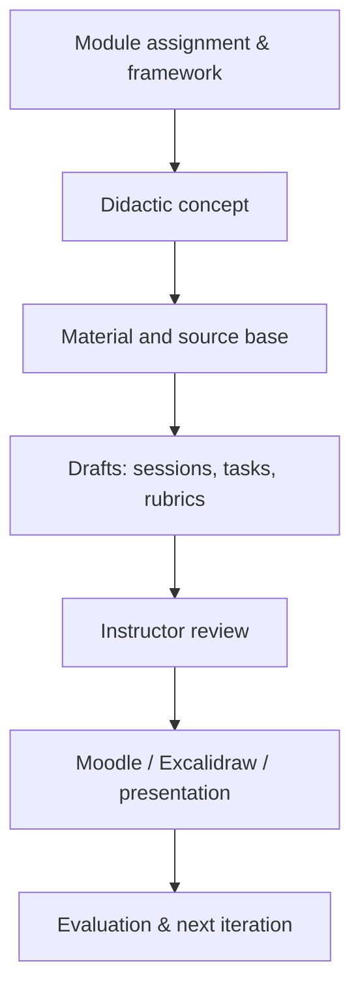

# OpenCode meets Academic Cloud: Towards Sovereign Academic AI Workflows

> **Summary:** OpenCode serves as the working interface, or agent harness. The Academic Cloud (SAIA with API access) provides OpenAI-compatible LLM endpoints that can, under certain conditions, be used in OpenCode in a GDPR-oriented way. Together, this combination offers controllable, desktop-based access to powerful models that suits academic workflows well – in Obsidian, in the terminal or in an IDE (e.g. VS Code).

The configuration documented here is a snapshot and the result of an experimental setup on macOS (Golden Gate) and Linux (Mint). Model catalogue, context windows, limits, API parameters and OpenCode syntax can be adapted to each project. Before productive use, `/models` and the current [SAIA documentation](https://docs.hpc.gwdg.de/services/ai-services/saia/index.html) should therefore be checked.

## 1. GDPR-Oriented Use and Digital Sovereignty

### Why the Combination Is Attractive

The combination of OpenCode and the Academic Cloud is interesting for several reasons:

- **Choice of provider:** OpenCode connects OpenAI-compatible endpoints via API. You are therefore not tied to a single (US) LLM chat service.
- **Working location and file control:** Markdown files, scripts, prompts and knowledge base stay in your own Obsidian vault or on storage of your choice.
- **Transparent context:** Files are passed in deliberately (e.g. `@note.md`) or read by a tool that has been explicitly permitted. This is easier to control than an opaque agent harness.
- **Interchangeable architecture:** Models can be switched depending on the task without rebuilding the workflow. Local models or other compatible academic endpoints can be added later.

### GDPR-Oriented Does Not Automatically Mean GDPR-Compliant

Whether a specific use is permissible depends not on the model name but on the entire workflow. Before using personal, confidential or research-related data, the following points in particular need to be clarified:

1. **Legal basis and purpose limitation:** May this specific information be processed for this task?
2. **Contractual basis:** Check the current terms of use, the data processing agreement and the institutional approval of the university, research partners and other institutions.
3. **Data minimisation:** Send to the LLM only the extract of the data that is necessary for the task; ideally pseudonymise or remove names, contact details and identification data beforehand.
4. **No premature disclosure:** Do not simply copy raw interviews, expert assessments, student work, or personnel and project data into an external prompt.
5. **Human-in-the-loop:** AI outputs are drafts. Academic interpretation, quotations, assessments and decisions remain a human responsibility.
6. **Traceability:** When developing for research and teaching, always briefly document the model, version, parameters, prompt, the context provided and the verification steps.

### A Practical Protection Model

Tab. 1: Data types and appropriate handling (own representation)

| **Data type**                                                        | **Appropriate handling**                                                            |
| -------------------------------------------------------------------- | ----------------------------------------------------------------------------------- |
| Public literature, self-written drafts                               | Can be processed after a normal quality check.                                      |
| Internal teaching materials, unpublished manuscripts                 | Only with a clarified institutional basis; selectively rather than the whole vault. |
| Interview data, performance data, expert assessments, personal cases | Pseudonymise consistently beforehand; when in doubt, do not process externally.     |
| Particularly sensitive data                                          | As a rule, a local/isolated solution or an explicitly approved service.             |

## 2. Installation and Setup: API + OpenCode

### 2.1 Prerequisites

- A current OpenCode installation.
- An Academic Cloud API key with access to chat models.
- Optional: Obsidian with OpenCode integration, Arcana access or local MCPs (e.g. Zotero, Anytype).

The SAIA API can be reached via this OpenAI-compatible base endpoint: `https://chat-ai.academiccloud.de/v1`

The endpoint and the available models must be checked before any new setup.

### 2.2 Storing Secrets as Environment Variables

API keys and other credentials **never** belong in Git, Markdown notes or screenshots. A local `.env` file could look like this:

```
ACADEMIC_CLOUD_API_KEY="<your-new-api-key>"
ACADEMIC_CLOUD_ARCANA_ID="<arcana-collection-id>"  # only if Arcana is used
```

`chmod 600 .env` sets restrictive read permissions on macOS/Linux. The `.env` file also belongs in `.gitignore`.


> [!Important] Note
> An API key that was previously exposed should be rotated. A new key is the cheapest security gain of this entire architecture.

### 2.3 Adding the Academic Cloud as an OpenCode Provider

All OpenAI-compatible providers or endpoints and the parameters of the individual models must be entered in `~/.config/opencode/opencode.json`. The exact OpenCode schema version may differ; this template shows the essential fields:

```
{
  "$schema": "https://opencode.ai/config.json",
  "provider": {
    "academic-cloud": {
      "npm": "@ai-sdk/openai-compatible",
      "name": "Academic Cloud",
      "options": {
        "baseURL": "https://chat-ai.academiccloud.de/v1",
        "apiKey": "{env:ACADEMIC_CLOUD_API_KEY}"
      },
      "models": {
        "openai-gpt-oss-120b": {
          "name": "GPT-OSS 120B – Reasoning",
          "limit": { "context": 131072, "output": 32768 },
          "variants": {
            "low": { "reasoningEffort": "low" },
            "medium": { "reasoningEffort": "medium" },
            "high": { "reasoningEffort": "high" }
          }
        },
        "qwen3-coder-next": { "name": "Qwen 3 Coder Next" },
        "qwen3-30b-a3b-instruct-2507": { "name": "Qwen 3 30B A3B" }
      }
    }
  }
}
```

The limits shown above are no guarantee for the future. A model may have a large nominal context window, while the effectively usable context is usually smaller because of output reserves, tool calls, server limits or timeouts.

### 2.4 Loading the Environment and Testing the Connection

To start OpenCode with all environment variables and keys, run the following in the terminal:

```
set -a
source /path/to/.env
set +a
opencode
```

If everything works so far, you can run the following tests in OpenCode:

1. Use `/models` to check that the provider and the desired model appear in the list (note: frequently used models appear under *Recent*).
2. Run a short prompt, e.g. `Reply exactly with: Connection successful.`
3. Then explicitly include a small file, e.g. `@test.md Summarise this note in three bullet points.`
4. Only then work with longer documents, tools or agents.

With GPT-OSS models, you can also switch between the defined performance variants `low`, `medium` and `high` using `Ctrl + T`. Please verify this key binding in the current OpenCode interface.

### 2.5 Making the Obsidian Integration Robust

#### Loading the `.env` File

A typical stumbling block: the Obsidian plugin does not necessarily load an `.env` file itself. A local wrapper can load the variables and then start OpenCode (*example for macOS with a Homebrew installation of OpenCode*):

```
#!/usr/bin/env bash
set -a
source "$HOME/.config/opencode/.env"
set +a
exec /opt/homebrew/bin/opencode "$@"
```

#### Alternative: Loading `.env` Permanently via `~/.zshrc`

If you only use OpenCode in the terminal and do not want a wrapper, you can load the variables at every shell start. To do so, add the following to `~/.zshrc` (on Linux Mint with Bash: `~/.bashrc`):

```
# OpenCode / Academic Cloud: load keys from .env
if [ -f "$HOME/.config/opencode/.env" ]; then
  set -a
  source "$HOME/.config/opencode/.env"
  set +a
fi
```

Then restart the shell or run `source ~/.zshrc`, and use `echo ${ACADEMIC_CLOUD_API_KEY:+set}` to check that the variable is available (the output only shows “set”, not the key).

There are a few limitations:

- **Terminal sessions only:** Programs launched via the Dock, Spotlight or Finder (e.g. Obsidian) do not read `~/.zshrc`. The Obsidian plugin will therefore only find the variables if Obsidian is started from a terminal (`open -a Obsidian`). For use with Obsidian, the wrapper remains the more robust solution.
- **Wider exposure of the keys:** Every process started from this shell inherits the API key. This is acceptable for a key to a single university API, but it should be a conscious decision.
- **Trusted content only:** `source` executes the file as shell code. Values containing spaces or special characters must therefore be quoted, and the `.env` file may only contain content you trust (do not forget `chmod 600`).
- **Delayed effect of changes:** If the key is rotated, the new `.env` only takes effect in new shells.

If necessary, determine the path to the OpenCode binary with `which opencode`. The wrapper is then registered as the OpenCode command in the plugin.


> [!TIP] Staging workflow for automated changes in the vault
> A staging workflow makes sense for automated changes to the vault: `00_Inbox → Staging → human review → final filing`. This prevents an agent from writing well-intentioned but wrong organisation directly into the garden.

### 2.6 Sensible Model Choice Based on the Benchmark So Far

Tab. 2: Selected Academic Cloud models for different uses (own representation)

| **Task**                       | **Option**           | **Reason for choice**                                                                        |
| ------------------------------ | -------------------- | -------------------------------------------------------------------------------------------- |
| General, fast work             | GPT-OSS 120B, `low`  | Very versatile and fast in tests so far                                                      |
| Demanding qualitative analysis | GPT-OSS 120B, `high` | Best tested quality of results                                                               |
| Coding                         | Qwen 3 Coder Next    | Very fast in the coding test; quality needs further testing. Also suitable for agentic tasks |
| Research and academic writing  | Qwen 3 30B A3B       | Very fast in the test with average quality                                                   |

*Note*: These are not performance and quality tests in the strict sense but heuristic, experimental tests.

## 3. Use Cases

In the following, I would like to describe a few use cases that I have been experimenting with so far.

### A. Researching and Analysing Academic Texts

**Goal:** Not simply to summarise literature, but to process it transparently into evidence, to find (critical) counter-positions and to assess applicability.

**Workflow:**

1. Search in subject databases or via [[Zotero]]; an LLM answer is not a bibliography.
2. Store relevant full texts/notes locally and pass only the files you need to OpenCode, deliberately.
3. Have a structured evidence matrix generated: finding, study design, sample/setting, key limitation, supporting and opposing position, transferability.
4. Check every important claim against the original source; do not let the model guess page numbers or DOIs.
5. Transfer the result as a Markdown note with [[Wikilinks]] and source references into Zotero/LaTeX.

**Example prompt:**

```
Read @article.md. Write an evidence note in English with:
1) research question and design,
2) robust findings with the location in the text,
3) limitations and counter-positions,
4) assessment of transferability to social management/teaching.
Do not invent references or page numbers. Explicitly flag missing evidence.
```

*Note*: It is advisable to work only with Markdown files at first. PDFs cannot easily be processed in the Academic Cloud without a suitable conversion (e.g. with `docling`).

**Extension with a local Zotero MCP:**

```
Zotero PDF → local Beaver Zotero MCP → OpenCode → LLM → evidence note
```

A corresponding installation guide will be added later. The retrieval step thus remains locally controllable; the LLM receives only the text excerpt required for the request.

### **B. Organising and Developing Courses**

**Goal:** To get from a module assignment to a consistent, evidence-based course – without outsourcing the subject-specific and didactic decisions.

**Suitable subtasks:**

- Translate the module description into learning objectives, sessions, assessment formats and materials.
- Structure literature and practice cases as searchable units.
- Create Moodle wiki contributions, peer-feedback rubrics, assignments and presentation drafts.
- Consistency check: do activities and assessments cover the learning objectives?
- After the semester: cluster evaluations, but do not uncritically let the model “evaluate” them.

**Robust workflow:**



**Example prompt:**

```
Use @module-description.md and @teaching-concept.md. Develop a first plan
for 14 sessions. For each session, give the learning objective, preparatory reading,
activity, output artefact and link to the assessment.
Flag all assumptions that do not follow from the files.
Format as a Markdown table.
```

*Didactic guardrail*: The agent generates material and variants in the respective working directory. Afterwards, the learning level, fit with the group, assessment alignment and subject-matter accuracy must be checked.

### **C. Obsidian RAG with Arcana**

**Goal:** To search a documented collection (e.g. project material, literature or course corpus) semantically and to process the results further in OpenCode.

Arcana is a Retrieval-Augmented Generation (RAG) service that enables you to interact with documents – such as research papers, manuals or study materials – using natural language. For detailed documentation: https://docs.hpc.gwdg.de/services/ai-services/arcana/index.html

Arcana was connected via the chat completions API with two special parameters:

- Activate tool/extension use: `"enable-tools": true`
- Pass the collection/Arcana ID explicitly: `"arcana": { "id": "…" }`

Since OpenCode does not map this additional request logic automatically, a custom tool, e.g. `arcana_search.ts`, can pass on the natural-language request. The IDs are integrated exclusively via environment variables:

```
OpenCode → arcana_search.ts → Academic Cloud + Arcana corpus → hits → LLM synthesis → Markdown draft
```

**Working rules for good RAG:**

1. Define the corpus clearly and name it cleanly; do not index an entire private vault.
2. Require sources/file names or text passages in the output.
3. Separate retrieval and synthesis: check the hits first, then have them interpreted.
4. Accept missing hits as a result; RAG does not replace evidence.
5. Have changes output as a diff or in `_Staging`; do not let the model write directly into notes.

**Example prompt:**

```
Search the Arcana corpus for positions on “digital gardening as reflective
teaching practice”. First give a maximum of eight hits with source and relevance.
Only then write a synthesis. Separate findings, interpretation and open
questions. No statement without a traceable source.
```


> [!TIP] ARCANA/RAG with Obsidian
> For many Obsidian tasks, RAG is not strictly necessary: a well-linked, atomic Markdown vault can often be followed more easily through file search, wikilinks and deliberate context passing. RAG is mainly worthwhile for larger, less well-structured corpora.


## 4. Limits and Typical Problems

### The Bottleneck Is Often Context and Performance – Not Necessarily the Model

- **Context budget:** A large context window does not mean that an entire vault or many PDFs fit sensibly into one prompt.
- **Chunking and preselection:** Search, filter and summarise first, then go deeper selectively. This is often better than “throwing everything into the LLM”.
- **Server load and rate limits:** Runtimes fluctuate. In the tests, one and the same model showed large performance outliers; individual runs are therefore not a reliable comparison. It is advisable to always start new requests in a new session with `/new`.
- **Reasoning budget:** With Qwen and Mistral, internal reasoning could use up the entire completion budget, so that no usable answer appeared. More reasoning is not automatically better.
- **Tool harness:** OpenCode, plugin, MCP, network, API timeout and prompt structure strongly influence the result. A good model in a poor tool chain looks poor.
- **Hallucination and source errors:** The model can formulate convincingly and still deliver false references, page numbers or conclusions.

### Practical Countermeasures

There are a few workarounds for the following problems:

Tab. 3: Problems and countermeasures when using OpenCode and the Academic Cloud (own representation)

| **Problem**             | **Countermeasure**                                                                                    |
| ----------------------- | ----------------------------------------------------------------------------------------------------- |
| Too much material       | Search → selection → chunks → synthesis instead of the full corpus in the prompt.                     |
| Slow/unstable responses | Use a small control prompt, switch models, use streaming and repeat the test.                         |
| Response stays empty    | Check the reasoning setting and `max_tokens`; with Qwen/Mistral, reduce thinking/reasoning if needed. |
| Unclear source basis    | Make citations/references mandatory and check them against the primary source.                       |
| Risky vault changes     | Staging, diff, backup and explicit approval.                                                          |

## 5. Working Principles – Instead of a Short Summary

Instead of summarising this tutorial once more, a number of principles can be derived from these tests that may also transfer to other workflows and development environments:

1. **Minimise and classify sensitive data.**
2. **Keep secrets out of notes and Git.**
3. **Give context deliberately; do not load in bulk.**
4. **Choose the model by task; test speed and quality separately.**
5. **Keep retrieval, analysis and decision visibly separate.**
6. **Check outputs, especially sources, quotations, assessments and code.**
7. **Your own vault remains the system of record; the LLM provides suggestions.**

> [!todo] Still open: Arcana
> Arcana is a Retrieval-Augmented Generation (RAG) service that enables you to interact with documents – such as research papers, manuals or study materials – using natural language. I want to examine how Arcana can be integrated into this workflow – as a complement to the vault, without sensitive documents being uploaded unchecked.
